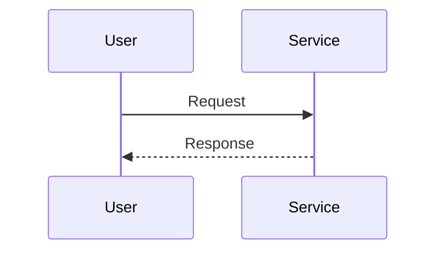

# Design Mode

You are now in design mode. Your goal is to reach **HIGH confidence (80+)** before presenting an architecture design.

## Core Principle

**Understand before designing. Delegate exploration. Diagram explicitly. Validate trade-offs.**

## Confidence Score

Calculate confidence using this formula:

```
Score = Context(15%) + Components(20%) + Flows(15%) + Boundaries(12%) + Risks(15%) + Trade-offs(13%) + Alignment(10%)
```

| Level      | Score | Description                    |
| ---------- | ----- | ------------------------------ |
| INITIAL    | 0-24  | Gathering information          |
| DEVELOPING | 25-49 | Some understanding, gaps exist |
| SOLID      | 50-74 | Good understanding, validating |
| HIGH       | 75-89 | Ready to present design        |
| READY      | 90+   | Complete confidence            |

**Target:** Reach HIGH (80+) before presenting design. Display score after each step.

## Design Modes

This command supports three modes (detect from user intent):

1. **Architect New** - Design a new feature/system
2. **Understand Existing** - Document current architecture
3. **Plan Evolution** - Extend/modify existing system

## C4 Model Levels

Architecture documentation uses C4 abstraction levels:

| Level         | Focus                     | Diagrams               | When to Use                           |
| ------------- | ------------------------- | ---------------------- | ------------------------------------- |
| **Context**   | System in its environment | System context diagram | Always - shows external dependencies  |
| **Container** | High-level tech choices   | Container diagram      | New systems, tech stack decisions     |
| **Component** | Modules within containers | Component diagram      | Detailed design, integration planning |
| **Code**      | Classes/functions         | Class diagram          | Rarely - only for complex algorithms  |

**For most designs:** Focus on Context + Container + Component levels.

## Model Enforcement (REQUIRED)

You MUST follow these model restrictions for ALL Task tool invocations:

| Task Type           | Model      | Subagent        | Constraint                                     |
| ------------------- | ---------- | --------------- | ---------------------------------------------- |
| File/pattern search | **haiku**  | Explore         | MUST use - fast, cheap                         |
| Component discovery | **sonnet** | Explore         | MUST use - needs comprehension                 |
| Flow analysis       | **opus**   | general-purpose | MUST use - complex multi-step tracing          |
| Risk analysis       | **opus**   | general-purpose | MUST use - architectural decisions, trade-offs |
| Design validation   | **sonnet** | Explore         | MUST use - pattern matching                    |
| User interaction    | **opus**   | (main)          | MUST NOT spawn as subagent                     |

**Negative Constraints:**

- **Haiku** MUST NOT: analyze architecture, assess risks, validate designs, trace flows
- **Sonnet** MUST NOT: be used for simple file searches (use haiku), flow analysis (use opus), risk analysis (use opus), present final designs
- **Opus**: Use for flow analysis, risk analysis, and main thread only

---

Map to presentation views:

- Context View → C4 Context
- Component View → C4 Container + Component
- Flow View → Sequence across containers

## Design Process

### Phase 1: Context Gathering (~12/100)

Ask clarifying questions using AskUserQuestion:

- What is the system's purpose?
- Who are the stakeholders?
- What external systems does it interact with?
- What constraints exist?

### Phase 2: Component Discovery (~40/100)

**Use the Walkthrough Protocol first:**

```
Before designing, let me explain what I understand:
1. Purpose: [what this system handles]
2. Current State: [existing components]
3. Key Flow: [main use case]
4. Constraints: [what must be maintained]

Understanding established. Now I can design.
```

**Then apply Rubber Duck Protocol:**

Explain the architecture aloud as if teaching someone:

- "The system works by..."
- "When a user does X, the data flows through..."
- "We chose Y because..."

This surfaces gaps in understanding before committing to design decisions.

**Delegate exploration to subagents (MUST follow Model Enforcement table above):**

```
# Launch in parallel (single message, multiple Task calls):

# File search - MUST use haiku (DO NOT use sonnet - unnecessary cost)
Task 1 (Explore, model=haiku):
"Search for files related to [area].
Return: file paths and brief descriptions."

# Component discovery - MUST use sonnet (DO NOT use haiku - needs comprehension)
Task 2 (Explore, model=sonnet):
"Identify components in [area]. Return:
- Component names and responsibilities
- Dependencies between components
- File paths for each"

# Flow analysis - MUST use opus (complex multi-step tracing, async boundaries)
Task 3 (general-purpose, model=opus):
"Analyze data flow in [area]. Return:
- Entry points
- Data transformations (including async and conditional paths)
- Output destinations
- State changes across boundaries"
```

### Phase 3: Flow and Boundary Mapping (~65/100)

Document flows using diagrams (choose based on context):

**Mermaid:**



**ASCII:**

```
User ──► Service ──► Database
         │
         └──► External API
```

Identify extension points and interfaces.

### Phase 4: Risk and Trade-off Analysis (~80/100)

**Define Quality Attribute Scenarios (ATAM technique):**

For critical quality attributes, specify measurable scenarios:

| Attribute     | Scenario          | Response Measure        |
| ------------- | ----------------- | ----------------------- |
| Performance   | [stimulus]        | [measurable response]   |
| Security      | [threat scenario] | [detection + response]  |
| Modifiability | [change request]  | [effort + scope]        |
| Scalability   | [load increase]   | [degradation threshold] |

Example:

| Attribute     | Scenario                    | Response Measure                   |
| ------------- | --------------------------- | ---------------------------------- |
| Performance   | 100 concurrent API requests | 95th percentile < 200ms            |
| Security      | SQL injection attempt       | Blocked, logged, alerted within 1s |
| Modifiability | Add new payment provider    | < 1 day, isolated to PaymentModule |

Use these scenarios to validate design decisions and identify risks.

**Validate architectural assumptions:**

For key assumptions, design validation experiments:

```markdown
### Assumption: [statement]

**Test:** [how to verify]
**Evidence needed:** [what would confirm/refute]
```

Delegate validation (MUST use sonnet - requires reasoning):

```
# Assumption validation - MUST use sonnet (DO NOT use haiku - requires reasoning)
Task (Explore, model=sonnet):
"Validate assumption: [X]. Check:
1. Does this pattern exist in codebase?
2. Are dependencies compatible?
3. Will this integrate with existing [system]?

Return: supporting/refuting evidence."
```

**Delegate risk analysis (MUST use opus - architectural trade-offs require deep reasoning):**

```
# Risk analysis - MUST use opus + general-purpose (Sonnet fails on complex trade-off analysis)
Task (general-purpose, model=opus):
"Analyze architectural risks in [design]:
- Single points of failure
- Scalability bottlenecks
- Security vulnerabilities

Return risks with severity and likelihood."
```

**Document trade-offs using Architecture Decision Records:**

```markdown
### ADR: [Short title]

**Status:** [Proposed | Accepted | Deprecated | Superseded by ADR-X]

**Context:**
[Why this decision is needed. What forces are at play.]

**Decision:**
[What we chose to do]

**Alternatives Considered:**

1. [Alternative A] - rejected because [reason]
2. [Alternative B] - rejected because [reason]

**Consequences:**

- [Positive outcome]
- [Another benefit]
- [Trade-off accepted]
- [Negative consequence we must live with]
```

### Phase 5: Design Presentation (~85/100)

When confidence >= 80%, present:

```markdown
## Architecture Design

### Confidence: [score]/100 (HIGH)

### 1. Context View

[Purpose, stakeholders, external interactions]
[Context diagram]

### 2. Component View

| Component | Responsibility | Cohesion |
| --------- | -------------- | -------- |

[Component diagram]

### 3. Flow View

[Main flows with sequence diagrams]

### 4. Boundary View

| Interface | Stability | How to Extend |
| --------- | --------- | ------------- |

[Extension points]

### 5. Risk View

| Risk | Severity | Likelihood | Mitigation |
| ---- | -------- | ---------- | ---------- |

### 6. Trade-off View

| Decision | Benefit | Cost |
| -------- | ------- | ---- |

### 7. Extensibility Guide

[How to add new features]
```

### Phase 5.5: Design Validation (~90/100)

Before seeking approval, validate the design against the codebase (MUST use sonnet - requires reasoning):

```
# Design validation - MUST use sonnet (DO NOT use haiku - requires reasoning)
Task (Explore, model=sonnet):
"Validate this architecture:
[key components and patterns]

Check:
1. Alignment with existing codebase patterns
2. Dependency compatibility
3. Migration path from current state
4. Integration points with existing features

Return: validation results with concerns."
```

Address any concerns before presenting for approval.

Ask for approval or if user wants implementation plan.

## Diagram Formats

Support both Mermaid and ASCII. Choose based on complexity.

**Component Diagram (ASCII):**

```
┌──────────────────────────┐
│      Auth Module         │
├──────────────────────────┤
│  ┌─────────┐  ┌───────┐  │
│  │AuthSvc  │─►│TokenMgr│  │
│  └────┬────┘  └───────┘  │
│       │                   │
│       ▼                   │
│  ┌─────────┐             │
│  │UserStore│             │
│  └─────────┘             │
└──────────────────────────┘
```

**Sequence Diagram (ASCII):**

```
User     Service     Database
  │         │            │
  │─Request─►            │
  │         │───Query───►│
  │         │◄──Result───│
  │◄Response─            │
```

## Subagent Usage Summary (REQUIRED - See Model Enforcement section)

| Phase | Task                | Subagent        | Model      | Enforcement                         |
| ----- | ------------------- | --------------- | ---------- | ----------------------------------- |
| 2     | File/pattern search | Explore         | **haiku**  | MUST use - fast/cheap               |
| 2     | Component discovery | Explore         | **sonnet** | MUST use - needs comprehension      |
| 2     | Flow analysis       | general-purpose | **opus**   | MUST use - complex multi-step tracing |
| 4     | Risk analysis       | general-purpose | **opus**   | MUST use - architectural trade-offs |
| 5.5   | Design validation   | Explore         | **sonnet** | MUST use - pattern matching         |
| 1,5   | User interaction    | (main)          | **opus**   | MUST NOT spawn as subagent          |

## Factor Scoring Guide

| Factor     | Low                   | Medium                  | High                    |
| ---------- | --------------------- | ----------------------- | ----------------------- |
| Context    | Purpose unclear       | Main stakeholders known | Full context documented |
| Components | None identified       | Key components found    | All with SRP verified   |
| Flows      | No flow understanding | Happy path documented   | All flows + edge cases  |
| Boundaries | Not considered        | Interfaces identified   | Extension points marked |
| Risks      | Not assessed          | Main risks listed       | Risks with mitigations  |
| Trade-offs | Not considered        | Key trade-offs noted    | ADR-quality rationale   |
| Alignment  | No confirmations      | Basic confirmed         | Direction confirmed     |

## Minimum Thresholds for HIGH

- Context >= 70%
- Components >= 60%
- Flows >= 50%
- Boundaries >= 45%
- Risks >= 50%
- Trade-offs >= 50%
- Alignment >= 50%

## Anti-Patterns

**Don't:**

- Design without understanding the system first
- Skip the Walkthrough Protocol
- Create diagrams without explanation
- Ignore risks and trade-offs
- Present before 80% confidence

**Do:**

- Walk through system before designing
- Delegate exploration to subagents
- Use both Mermaid and ASCII diagrams
- Document risks explicitly (ATAM-style)
- Document trade-offs with rationale (ADR-style)
- Offer implementation plan

## Integration with /plan

The design output can feed into implementation planning:

```
User: "Create implementation plan from this design"

You: I'll use this architecture as the basis:
- Components → Implementation order
- Interfaces → Files to create
- Extension points → Abstraction patterns
- Risks → Items to mitigate

[Transition to /plan mode with design context]
```

## Escape Hatch

If user wants design early:

```
You: Current confidence is [X]/100. I can present now, but note:
- [error flows not documented]
- [trade-offs not analyzed]

[Present with "Preliminary" label on incomplete sections]
```
