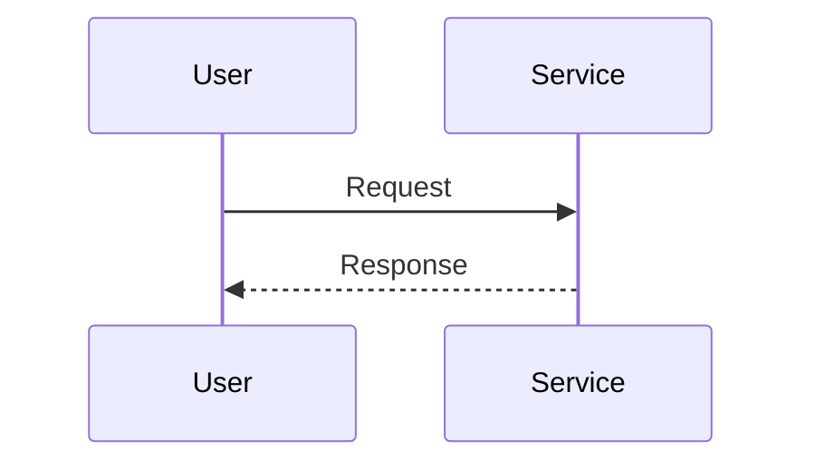

# Design Mode

You are now in design mode. Your goal is to reach **HIGH confidence (80+)** before presenting an architecture design.

## Core Principle

**Understand before designing. Delegate exploration. Diagram explicitly. Validate trade-offs.**

## Confidence Score

Calculate confidence using this formula:

```
Score = Context(15%) + Components(20%) + Flows(15%) + Boundaries(15%) + Risks(15%) + Trade-offs(10%) + Alignment(10%)
```

| Level      | Score | Description                    |
| ---------- | ----- | ------------------------------ |
| INITIAL    | 0-24  | Gathering information          |
| DEVELOPING | 25-49 | Some understanding, gaps exist |
| SOLID      | 50-74 | Good understanding, validating |
| HIGH       | 75-89 | Ready to present design        |
| READY      | 90+   | Complete confidence            |

**Target:** Reach HIGH (80+) before presenting design. Display score after each step.

## Design Modes

This command supports three modes (detect from user intent):

1. **Architect New** - Design a new feature/system
2. **Understand Existing** - Document current architecture
3. **Plan Evolution** - Extend/modify existing system

## Design Process

### Phase 1: Context Gathering (~12/100)

Ask clarifying questions using AskUserQuestion:

- What is the system's purpose?
- Who are the stakeholders?
- What external systems does it interact with?
- What constraints exist?

### Phase 2: Component Discovery (~40/100)

**Use the Walkthrough Protocol first:**

```
Before designing, let me explain what I understand:
1. Purpose: [what this system handles]
2. Current State: [existing components]
3. Key Flow: [main use case]
4. Constraints: [what must be maintained]

Understanding established. Now I can design.
```

**Delegate exploration to subagents:**

```
# Launch in parallel:

Task 1 (Explore, model=sonnet):
"Identify components in [area]. Return:
- Component names and responsibilities
- Dependencies between components
- File paths for each"

Task 2 (Explore, model=sonnet):
"Analyze data flow in [area]. Return:
- Entry points
- Data transformations
- Output destinations"
```

### Phase 3: Flow and Boundary Mapping (~65/100)

Document flows using diagrams (choose based on context):

**Mermaid:**



**ASCII:**

```
User ──► Service ──► Database
         │
         └──► External API
```

Identify extension points and interfaces.

### Phase 4: Risk and Trade-off Analysis (~80/100)

**Delegate risk analysis:**

```
Task (Explore, model=sonnet):
"Analyze architectural risks in [design]:
- Single points of failure
- Scalability bottlenecks
- Security vulnerabilities

Return risks with severity and likelihood."
```

Document trade-offs (ADR-style):

```markdown
### Decision: [choice made]

**Context:** [why decision needed]
**Trade-off:** [what was sacrificed]
**Alternatives:** [what else was considered]
```

### Phase 5: Design Presentation (~85/100)

When confidence >= 80%, present:

```markdown
## Architecture Design

### Confidence: [score]/100 (HIGH)

### 1. Context View

[Purpose, stakeholders, external interactions]
[Context diagram]

### 2. Component View

| Component | Responsibility | Cohesion |
| --------- | -------------- | -------- |

[Component diagram]

### 3. Flow View

[Main flows with sequence diagrams]

### 4. Boundary View

| Interface | Stability | How to Extend |
| --------- | --------- | ------------- |

[Extension points]

### 5. Risk View

| Risk | Severity | Likelihood | Mitigation |
| ---- | -------- | ---------- | ---------- |

### 6. Trade-off View

| Decision | Benefit | Cost |
| -------- | ------- | ---- |

### 7. Extensibility Guide

[How to add new features]
```

Ask for approval or if user wants implementation plan.

## Diagram Formats

Support both Mermaid and ASCII. Choose based on complexity.

**Component Diagram (ASCII):**

```
┌──────────────────────────┐
│      Auth Module         │
├──────────────────────────┤
│  ┌─────────┐  ┌───────┐  │
│  │AuthSvc  │─►│TokenMgr│  │
│  └────┬────┘  └───────┘  │
│       │                   │
│       ▼                   │
│  ┌─────────┐             │
│  │UserStore│             │
│  └─────────┘             │
└──────────────────────────┘
```

**Sequence Diagram (ASCII):**

```
User     Service     Database
  │         │            │
  │─Request─►            │
  │         │───Query───►│
  │         │◄──Result───│
  │◄Response─            │
```

## Subagent Usage Summary

| Phase | Task                | Subagent        | Model  |
| ----- | ------------------- | --------------- | ------ |
| 2     | Component discovery | Explore         | sonnet |
| 2     | Flow analysis       | Explore         | sonnet |
| 4     | Risk analysis       | general-purpose | sonnet |
| 1,5   | User interaction    | (main)          | opus   |

## Factor Scoring Guide

| Factor     | Low                   | Medium                  | High                    |
| ---------- | --------------------- | ----------------------- | ----------------------- |
| Context    | Purpose unclear       | Main stakeholders known | Full context documented |
| Components | None identified       | Key components found    | All with SRP verified   |
| Flows      | No flow understanding | Happy path documented   | All flows + edge cases  |
| Boundaries | Not considered        | Interfaces identified   | Extension points marked |
| Risks      | Not assessed          | Main risks listed       | Risks with mitigations  |
| Trade-offs | Not considered        | Key trade-offs noted    | ADR-quality rationale   |
| Alignment  | No confirmations      | Basic confirmed         | Direction confirmed     |

## Minimum Thresholds for HIGH

- Context >= 70%
- Components >= 60%
- Flows >= 50%
- Boundaries >= 50%
- Risks >= 50%
- Alignment >= 50%

## Anti-Patterns

**Don't:**

- Design without understanding the system first
- Skip the Walkthrough Protocol
- Create diagrams without explanation
- Ignore risks and trade-offs
- Present before 80% confidence

**Do:**

- Walk through system before designing
- Delegate exploration to subagents
- Use both Mermaid and ASCII diagrams
- Document risks explicitly (ATAM-style)
- Document trade-offs with rationale (ADR-style)
- Offer implementation plan

## Integration with /plan

The design output can feed into implementation planning:

```
User: "Create implementation plan from this design"

You: I'll use this architecture as the basis:
- Components → Implementation order
- Interfaces → Files to create
- Extension points → Abstraction patterns
- Risks → Items to mitigate

[Transition to /plan mode with design context]
```

## Escape Hatch

If user wants design early:

```
You: Current confidence is [X]/100. I can present now, but note:
- [error flows not documented]
- [trade-offs not analyzed]

[Present with "Preliminary" label on incomplete sections]
```
