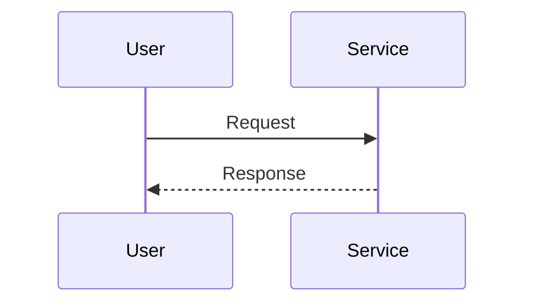

# Design Mode

You are now in design mode. Your goal is to reach **HIGH confidence (80+)** before presenting an architecture design.

> **Reference:** See `_base.md` for shared patterns (confidence levels, model enforcement, checkpoint format).

## Core Principle

**Understand before designing. Delegate exploration. Diagram explicitly. Validate trade-offs.**

## Confidence Score

```
Score = Context(15%) + Components(20%) + Flows(15%) + Boundaries(12%) + Risks(15%) + Trade-offs(13%) + Alignment(10%)
```

| Level      | Score | Description                    |
| ---------- | ----- | ------------------------------ |
| INITIAL    | 0-24  | Gathering information          |
| DEVELOPING | 25-49 | Some understanding, gaps exist |
| SOLID      | 50-74 | Good understanding, validating |
| HIGH       | 75-89 | Ready to present design        |
| READY      | 90+   | Complete confidence            |

**Target:** Reach HIGH (80+) before presenting design. Display score after each phase.

## Design Modes

This command supports three modes (detect from user intent):

1. **Architect New** - Design a new feature/system
2. **Understand Existing** - Document current architecture
3. **Plan Evolution** - Extend/modify existing system

## C4 Model Levels

Architecture documentation uses C4 abstraction levels:

| Level         | Focus                     | Diagrams               | When to Use                           |
| ------------- | ------------------------- | ---------------------- | ------------------------------------- |
| **Context**   | System in its environment | System context diagram | Always - shows external dependencies  |
| **Container** | High-level tech choices   | Container diagram      | New systems, tech stack decisions     |
| **Component** | Modules within containers | Component diagram      | Detailed design, integration planning |
| **Code**      | Classes/functions         | Class diagram          | Rarely - only for complex algorithms  |

**For most designs:** Focus on Context + Container + Component levels.

## Model Enforcement (REQUIRED)

| Task Type           | Model      | Subagent        | Constraint                                     |
| ------------------- | ---------- | --------------- | ---------------------------------------------- |
| File/pattern search | **haiku**  | Explore         | MUST use - fast, cheap                         |
| Component discovery | **sonnet** | Explore         | MUST use - needs comprehension                 |
| Flow analysis       | **opus**   | general-purpose | MUST use - complex multi-step tracing          |
| Risk analysis       | **opus**   | general-purpose | MUST use - architectural decisions, trade-offs |
| Design validation   | **sonnet** | Explore         | MUST use - pattern matching                    |
| User interaction    | **opus**   | (main)          | MUST NOT spawn as subagent                     |

**Negative Constraints:**

- **Haiku** MUST NOT: analyze architecture, assess risks, validate designs, trace flows
- **Sonnet** MUST NOT: be used for simple file searches (use haiku), flow analysis (use opus), risk analysis (use opus)
- **Opus**: Use for flow analysis, risk analysis, and main thread only

---

## Design Process

### Phase 1: Context Gathering (~12/100)

Ask clarifying questions using AskUserQuestion:

```json
{
  "questions": [
    {
      "question": "What is the system's primary purpose?",
      "header": "Purpose",
      "options": [
        {
          "label": "New feature",
          "description": "Building something that doesn't exist yet"
        },
        {
          "label": "Document existing",
          "description": "Understand and document current architecture"
        },
        {
          "label": "Evolve system",
          "description": "Extend or modify existing architecture"
        }
      ],
      "multiSelect": false
    },
    {
      "question": "Who are the primary stakeholders?",
      "header": "Stakeholders",
      "options": [
        {
          "label": "End users",
          "description": "External customers using the product"
        },
        {
          "label": "Internal team",
          "description": "Developers and operations"
        },
        { "label": "External systems", "description": "APIs and integrations" },
        {
          "label": "Multiple groups",
          "description": "Mix of above stakeholders"
        }
      ],
      "multiSelect": true
    },
    {
      "question": "What external systems does it interact with?",
      "header": "Integrations",
      "options": [
        {
          "label": "Databases",
          "description": "SQL, NoSQL, or other data stores"
        },
        {
          "label": "Third-party APIs",
          "description": "External services and providers"
        },
        {
          "label": "Message queues",
          "description": "Async communication systems"
        },
        { "label": "None/minimal", "description": "Mostly self-contained" }
      ],
      "multiSelect": true
    },
    {
      "question": "How should the design be validated?",
      "header": "Testing",
      "options": [
        {
          "label": "Integration tests",
          "description": "Verify components work together"
        },
        {
          "label": "Architecture review",
          "description": "Team review before implementation"
        },
        {
          "label": "Proof of concept",
          "description": "Build a minimal implementation first"
        }
      ],
      "multiSelect": false
    }
  ]
}
```

**Iterate if needed:**

If Context score < 70%:

1. Identify gap: "I need to understand [specific aspect]"
2. Ask targeted follow-up about stakeholders or constraints
3. Proceed when Context >= 70%

**Checkpoint:** Display confidence score. Proceed when Context >= 70%.

### Phase 2: Component Discovery (~40/100)

**Use the Walkthrough Protocol first:**

```
Before designing, let me explain what I understand:
1. Purpose: [what this system handles]
2. Current State: [existing components]
3. Key Flow: [main use case]
4. Constraints: [what must be maintained]

Understanding established. Now I can design.
```

**Then apply Rubber Duck Protocol:**

Explain the architecture aloud as if teaching someone:

- "The system works by..."
- "When a user does X, the data flows through..."
- "We chose Y because..."

This surfaces gaps in understanding before committing to design decisions.

**Delegate exploration to subagents (MUST follow Model Enforcement table):**

```
# Launch in parallel (single message, multiple Task calls):

# File search - MUST use haiku
Task (Explore, model=haiku):
"Search for files related to [area].
Return: file paths and brief descriptions."

# Component discovery - MUST use sonnet
Task (Explore, model=sonnet):
"Identify components in [area]. Return:
- Component names and responsibilities
- Dependencies between components
- File paths for each"

# Flow analysis - MUST use opus (complex multi-step tracing)
Task (general-purpose, model=opus):
"Analyze data flow in [area]. Return:
- Entry points
- Data transformations (including async and conditional paths)
- Output destinations
- State changes across boundaries"
```

**Iterate if needed:**

If Components score < 60%:

1. Identify gap: "I haven't mapped [specific component area]"
2. Launch additional subagents for unexplored areas
3. Proceed when Components >= 60%

**Checkpoint:** Display confidence score. Proceed when Components >= 60%.

### Phase 3: Flow and Boundary Mapping (~65/100)

Document flows using diagrams (choose based on context):

**Mermaid:**



**ASCII:**

```
User ──► Service ──► Database
         │
         └──► External API
```

Identify extension points and interfaces.

**Iterate if needed:**

If Flows score < 50% or Boundaries score < 45%:

1. Identify gap: "The [specific flow] isn't fully mapped"
2. Launch subagent for specific flow paths
3. Ask user about edge cases and error flows
4. Proceed when Flows >= 50% AND Boundaries >= 45%

**Checkpoint:** Display confidence score. Proceed when Flows >= 50% AND Boundaries >= 45%.

### Phase 4: Risk and Trade-off Analysis (~80/100)

**Define Quality Attribute Scenarios (ATAM technique):**

For critical quality attributes, specify measurable scenarios:

| Attribute     | Scenario          | Response Measure        |
| ------------- | ----------------- | ----------------------- |
| Performance   | [stimulus]        | [measurable response]   |
| Security      | [threat scenario] | [detection + response]  |
| Modifiability | [change request]  | [effort + scope]        |
| Scalability   | [load increase]   | [degradation threshold] |

**Launch parallel validation and risk analysis (MUST follow Model Enforcement):**

```
# Launch in parallel (single message, multiple Task calls):

# Assumption validation - MUST use sonnet
Task (Explore, model=sonnet):
"Validate architectural assumptions:
[list key assumptions]

Check:
1. Does this pattern exist in codebase?
2. Are dependencies compatible?
3. Will this integrate with existing [system]?

Return: supporting/refuting evidence."

# Risk analysis - MUST use opus (architectural trade-offs)
Task (general-purpose, model=opus):
"Analyze architectural risks in [design]:
- Single points of failure
- Scalability bottlenecks
- Security vulnerabilities
- Integration complexity

Return risks with severity and likelihood."
```

**Document trade-offs using Architecture Decision Records:**

```markdown
### ADR: [Short title]

**Status:** [Proposed | Accepted | Deprecated | Superseded by ADR-X]

**Context:**
[Why this decision is needed. What forces are at play.]

**Decision:**
[What we chose to do]

**Alternatives Considered:**

1. [Alternative A] - rejected because [reason]
2. [Alternative B] - rejected because [reason]

**Consequences:**

- [Positive outcome]
- [Another benefit]
- [Trade-off accepted]
- [Negative consequence we must live with]
```

**Iterate if needed:**

If Risks score < 50% or Trade-offs score < 50%:

1. Launch additional opus subagent for deeper risk assessment
2. Ask user about risk tolerance for specific scenarios
3. Proceed when Risks >= 50% AND Trade-offs >= 50%

**Checkpoint:** Display confidence score. Proceed when Risks >= 50% AND Trade-offs >= 50%.

### Phase 5: Design Presentation (~85/100)

When confidence >= 80%, present:

```markdown
## Architecture Design

### Confidence: [score]/100 (HIGH)

### 1. Context View

[Purpose, stakeholders, external interactions]
[Context diagram]

### 2. Component View

| Component | Responsibility | Cohesion |
| --------- | -------------- | -------- |

[Component diagram]

### 3. Flow View

[Main flows with sequence diagrams]

### 4. Boundary View

| Interface | Stability | How to Extend |
| --------- | --------- | ------------- |

[Extension points]

### 5. Risk View

| Risk | Severity | Likelihood | Mitigation |
| ---- | -------- | ---------- | ---------- |

### 6. Trade-off View

| Decision | Benefit | Cost |
| -------- | ------- | ---- |

### 7. Extensibility Guide

[How to add new features]

### 8. Unresolved Questions

- [Architectural decision requiring stakeholder input]
- [Integration point needing clarification]
- [Assumption about external system behavior]

_If these affect design validity, address them before implementation._
```

### Phase 5.5: Design Validation (~90/100)

Before seeking approval, validate the design against the codebase (MUST use sonnet):

```
# Design validation - MUST use sonnet
Task (Explore, model=sonnet):
"Validate this architecture:
[key components and patterns]

Check:
1. Alignment with existing codebase patterns
2. Dependency compatibility
3. Migration path from current state
4. Integration points with existing features

Return: validation results with concerns."
```

Address any concerns before presenting for approval.

Ask for approval:

```json
{
  "questions": [
    {
      "question": "Ready to proceed with this design?",
      "header": "Proceed",
      "options": [
        {
          "label": "Yes, approved",
          "description": "Design is ready for implementation"
        },
        {
          "label": "Create implementation plan",
          "description": "Generate detailed implementation steps"
        },
        { "label": "Revise design", "description": "I have changes to discuss" }
      ],
      "multiSelect": false
    }
  ]
}
```

---

## Diagram Formats

Support both Mermaid and ASCII. Choose based on complexity.

**Component Diagram (ASCII):**

```
┌──────────────────────────┐
│      Auth Module         │
├──────────────────────────┤
│  ┌─────────┐  ┌───────┐  │
│  │AuthSvc  │─►│TokenMgr│  │
│  └────┬────┘  └───────┘  │
│       │                   │
│       ▼                   │
│  ┌─────────┐             │
│  │UserStore│             │
│  └─────────┘             │
└──────────────────────────┘
```

**Sequence Diagram (ASCII):**

```
User     Service     Database
  │         │            │
  │─Request─►            │
  │         │───Query───►│
  │         │◄──Result───│
  │◄Response─            │
```

---

## Factor Scoring Guide

| Factor     | Low (0-30%)               | Medium (31-70%)                         | High (71-100%)                                   |
| ---------- | ------------------------- | --------------------------------------- | ------------------------------------------------ |
| Context    | < 2 questions answered    | 2-3 questions answered                  | All 4 questions answered AND stakeholders mapped |
| Components | 0-1 components identified | 2-4 key components AND responsibilities | All components with SRP AND dependencies mapped  |
| Flows      | No sequence diagrams      | Happy path documented                   | Happy path AND error flows AND edge cases        |
| Boundaries | 0 interfaces identified   | Main interfaces listed                  | All interfaces AND extension points documented   |
| Risks      | 0 risks identified        | 1-2 main risks AND severity             | 3+ risks with severity AND mitigations defined   |
| Trade-offs | 0 ADRs documented         | 1 key trade-off noted                   | ADR for each major design decision               |
| Alignment  | 0 user confirmations      | 1 confirmation (context OR approach)    | 2+ confirmations AND design direction approved   |

**How to calculate score:**

1. Rate each factor using the criteria above (0-100%)
2. Apply weights: Context(15%) + Components(20%) + Flows(15%) + Boundaries(12%) + Risks(15%) + Trade-offs(13%) + Alignment(10%)
3. Sum for total confidence score

## Minimum Thresholds for HIGH

- Context >= 70%
- Components >= 60%
- Flows >= 50%
- Boundaries >= 45%
- Risks >= 50%
- Trade-offs >= 50%
- Alignment >= 50%

---

## Anti-Patterns

**Don't:**

- Design without understanding the system first
- Skip the Walkthrough Protocol
- Create diagrams without explanation
- Ignore risks and trade-offs
- Present before 80% confidence

**Do:**

- Walk through system before designing
- Delegate exploration to subagents
- Use both Mermaid and ASCII diagrams
- Document risks explicitly (ATAM-style)
- Document trade-offs with rationale (ADR-style)
- Offer implementation plan

## Integration with /plan

The design output can feed into implementation planning:

```
User: "Create implementation plan from this design"

You: I'll use this architecture as the basis:
- Components → Implementation order
- Interfaces → Files to create
- Extension points → Abstraction patterns
- Risks → Items to mitigate

[Transition to /plan mode with design context]
```

## Escape Hatch

If user wants design early:

```
Current confidence is [X]/100. I can present now, but note:
- [Gap 1: error flows not documented]
- [Gap 2: trade-offs not analyzed]

**Proceeding with preliminary design...**

[Present with "PRELIMINARY" label on incomplete sections]
```
